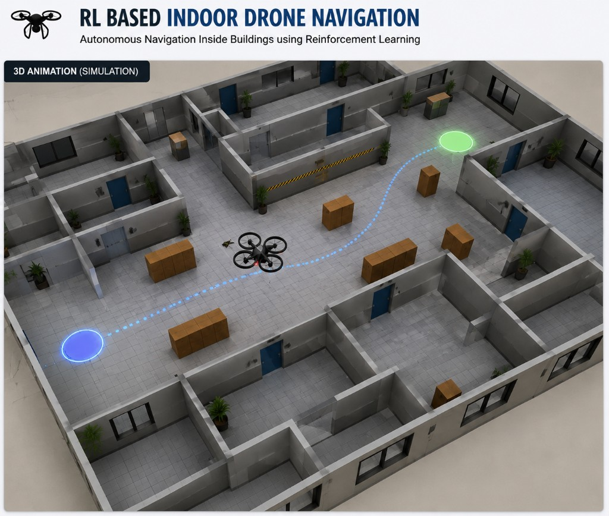

# RL Indoor Drone Navigation Demo

Autonomous indoor drone navigation using **Reinforcement Learning**, with a 3D Three.js web simulation UI.



## Project Structure

```
DRONE/
├── env/                    # Gymnasium RL environment
│   └── indoor_drone_env.py
├── agent/                  # A* path planning + playback (not the RL agent)
│   └── navigator.py
├── server/                 # FastAPI + WebSocket
│   └── app.py
├── web/                    # Three.js 3D UI
│   ├── index.html
│   └── static/
│       ├── css/style.css
│       └── js/
│           ├── main.js     # UI controls & WebSocket
│           └── scene.js    # Three.js 3D scene
├── train.py                # PPO training script
├── run_demo.py             # Start demo server
├── requirements.txt
├── README.md
└── assets/                 # Screenshots & media
```

| Folder / file | Role |
|---------------|------|
| `env/` | Gymnasium environment: map, lidar, rewards, drone physics |
| `agent/` | A* planner, path safety checks, scripted demo playback |
| `server/` | REST API, WebSocket simulation loop, model loading |
| `web/` | Browser UI: point picking, HUD, Three.js visualization |
| `train.py` | Train PPO agent; saves to `models/` (created on first run) |
| `run_demo.py` | Entry point — starts server at `http://localhost:8000` |

## Features

- **Custom Gymnasium Environment** — Indoor building with walls, corridors, and crate obstacles
- **Lidar-based Observations** — 16-ray distance sensors + goal direction + velocity
- **PPO Agent** — Trained with Stable-Baselines3 (Proximal Policy Optimization)
- **3D Web Visualization (Three.js)** — Gray floor/walls, brown crates, animated quadcopter
- **Click-to-set Start/Goal** — Collision-free A* path planning
- **Heuristic Fallback** — Demo runs immediately without a trained model

## Quick Start

### 1. Install Dependencies

```bash
cd "d:\TIH PROJECTS\DRONE"
python -m venv venv
venv\Scripts\activate
pip install -r requirements.txt
```

### 2. Run the Demo

```bash
python run_demo.py
```

Open **http://localhost:8000** in your browser.

### 3. Train the RL Agent (Optional)

```bash
python train.py
```

After training, the model is saved to `models/ppo_indoor_drone.zip` and loaded automatically by the server.

## RL Environment Details

| Component | Description |
|-----------|-------------|
| **State** | 16 lidar rays + goal direction (2) + velocity (2) + yaw (1) |
| **Actions** | Forward velocity, strafe velocity, yaw rate (continuous) |
| **Rewards** | +10 per unit closer to goal, +100 on arrival, -50 on collision |
| **Map** | 20×20 grid with walls, rooms, corridors, and crate obstacles |

## Controls

| Button | Action |
|--------|--------|
| **Set Start / Set Goal** | Click open floor tiles to place markers |
| **Start Demo** | Run navigation along the planned path |
| **Reset** | Reset environment to default |

## Tech Stack

- **Python** — RL environment & training
- **Gymnasium** — RL environment API
- **Stable-Baselines3** — PPO algorithm
- **FastAPI** — Backend server
- **Three.js** — 3D visualization
- **WebSocket** — Real-time simulation streaming

## License

MIT
